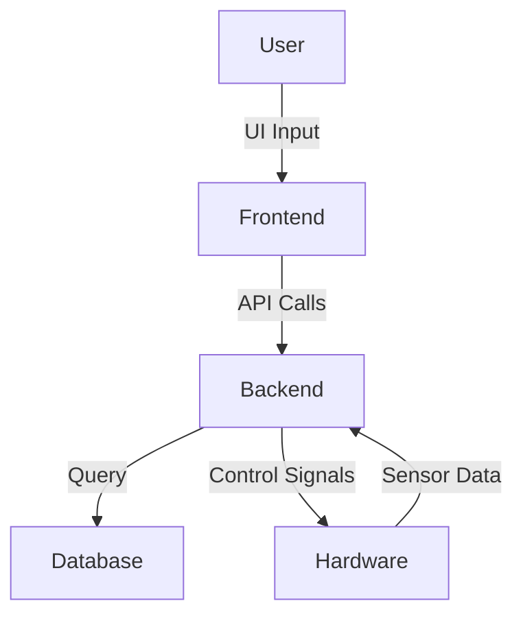

# 🚀 Project Title: [Replace with Your Project Name]

## 📌 Overview
[Brief one-paragraph summary of what this project does. Describe its purpose and core functionality.]

## 🧠 Key Features
- ✅ [Feature 1: e.g., Real-time tracking / face recognition / smart control]
- ✅ [Feature 2: e.g., Mobile App Integration / IoT Support]
- ✅ [Feature 3: e.g., Admin Dashboard / Data Analytics]
- ✅ [Optional: AI/ML integration, if applicable]

## 🛠️ Technologies Used

### 💻 Frontend


### 🧩 Backend


### 🗄️ Database


### ⚙️ Hardware (if applicable)


## 🧩 Available Platforms
- 📱 Android
- 💻 Windows
- 🌐 Web
- 📲 iOS *(if supported)*
- 🚀 Embedded (ESP32, NodeMCU)

## ⚙️ System Architecture
> _Describe how the system components interact — frontend, backend, database, and hardware._


## 📸 Screenshots / Demo

| Mobile View | Dashboard | Hardware Setup |
|-------------|-----------|----------------|
|  |  |  |

> 📽️ [Demo Video](https://www.youtube.com/watch?v=demo-link)

## 📱 Installation & Setup

### Prerequisites
- [ ] Node.js (vXX.X.X)
- [ ] Flutter SDK (vX.X.X)
- [ ] Java JDK (for Java Swing apps)
- [ ] ESP32/NodeMCU drivers (if hardware involved)
- [ ] Android Studio / Visual Studio Code

### Setup Steps
```bash
# Clone the repository
git clone https://github.com/your-username/your-project-name.git
cd your-project-name

# Install dependencies
npm install         # For Node.js backend
flutter pub get     # For Flutter frontend

# Start the development server
npm run dev         # or node server.js

# Run the Flutter app
flutter run
```

## 📦 Deployment
- Firebase Hosting / Vercel / Netlify *(for Web)*
- Google Play Console *(for Android apps)*
- ESP32 OTA updates via Arduino IDE *(for embedded apps)*

## 📄 License
This project is licensed under the [MIT License](LICENSE).

## 🙋‍♂️ Contributors
- [Your Name](https://github.com/your-username)
- [Collaborator 1](https://github.com/collab1)
- [Collaborator 2](https://github.com/collab2)
